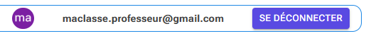
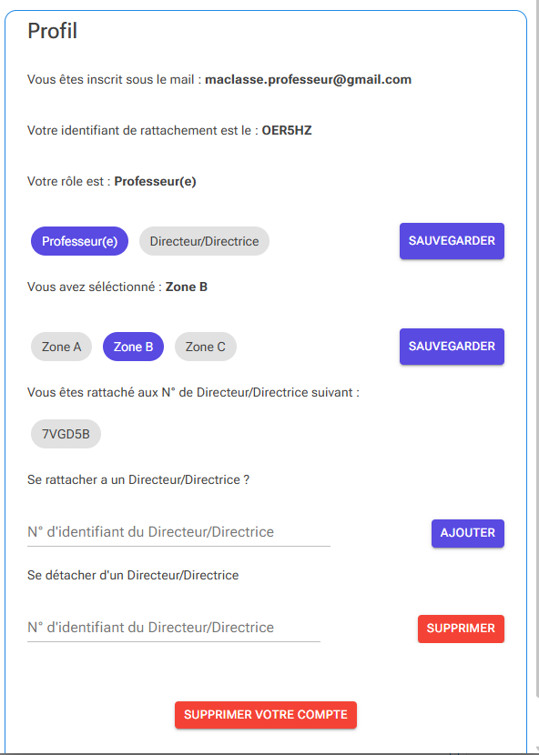
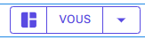
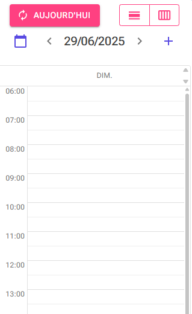
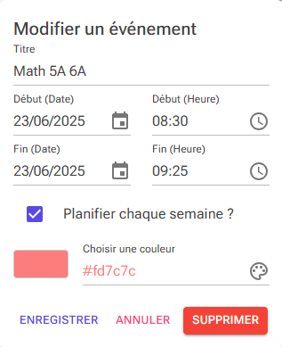
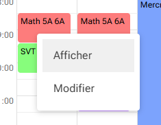
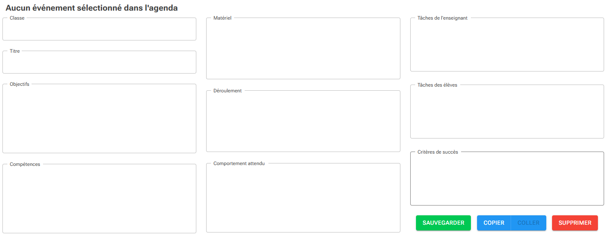
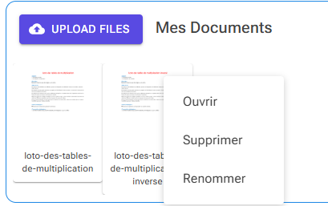

# Manuel d'utilisation de l'application maclasse
## Page d'Accueil

Cliquer sur le bouton Google pour vous connecter avec un compte Google
Vous pouvez utiliser les comptes suivants pour vous connecter :

- maclasse.professeur@gmail.com /  m4cl4ss3?NWS
- maclasse.direction@gmail.com  /  m4cl4ss3?NWS

A noté que le compte "direction" a les mêmes fonctionnalités que le compte professeur avec la possibilité de
visualisation des comptes des professeurs rattachés à la direction. C'est le cas pour ces 2 deux comptes.

## **Important pour les données consultables**

Le jeu de données disponible pour le professeur sont les cours suivants :

- Le cours de Math du Lundi 23/06/2025 8h30/9h25
- Le cours de Physique Chimie du Lundi 23/06/2025 14h/14h55
- Le cours de Musique du Mardi 24/06/2025 15h10/16h05

**Merci pendant votre test de ne pas effacer l'emploi du temps qui débute au 28/04/2025 jusqu'au vacances d'été**
**Merci également de ne pas effacer les cours cités ci-dessus**

## Icône en haut à droite

- Le 1er permet d'accèder à votre profil
- Le 2ème permet d'accéder à votre compte Gmail
- Le 3ème permet de vous déconnecter de l'application

## Votre profil

- Rappel de votre identifiant de connexion
- Votre identifiant de rattachement (Professeur ou Direction)
- Votre rôle
- Votre zone
- Récapitulatif de vos rattachements
- Ajout ou Suppression d'un rattachement
- Suppression de votre compte

## Si vous êtes directeur

Un icône sera présent en haut à gauche pour choisir le compte professeur que vous souhaitez voir

## Calendrier

- Le bouton "Aujourd'hui" vous permet de revenir à la date du jour
- Les 2 boutons suivants permettent de choisir la vue "hebdomadaire" ou "journalière"
- L'icône de calendrier permet d'accéder à la date voulue
- Les chevrons autours de la date permettent de naviguer jour par jour ou semaine par semaine
- Le signe "plus" permet de rajouter une nouvelle séance

Que cela soit en vue "hebdomadaire" ou "journalière", cliquer sur le calendrier à l'heure et le
jour voulus permet de créer une nouvelle séance.

- Choisisser les horaires et les dates de votre cours, son titre
- Planifier chaque semaine ? Permet de rendre la séance récurrente chaque semaine

Pour afficher une leçon, cliquer sur la séance qui vous intéresse. Afficher permet de l'afficher à gauche et 
Modifier vous permet de modifier la programmation de la séance.

## Leçon

- Vous pouvez écrire dans chaque case de la leçon en cliquant dessus
- Le Copier/coller vous permet de copier la leçon et les documents et de les coller dans une autre leçon
- Le bouton supprimer permet d'effacer la leçon mais aussi les documents associés

## Documents

- Upload Files vous permet de rajouter des documents à la leçon, pour le moment seul sont acceptés les formats courants d'images et les pdf
- En cliquant sur le document, vous pouvez l'ouvrir, le supprimer ou le renommer
